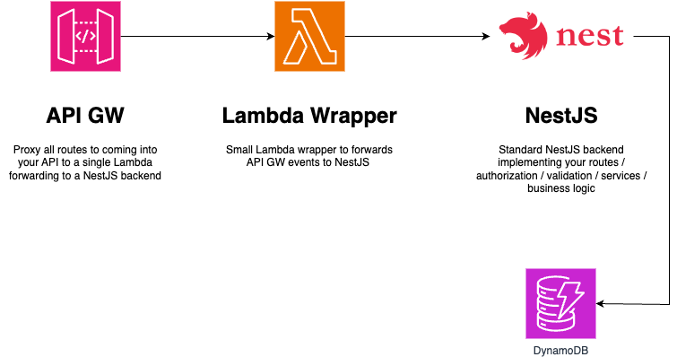

# Simple NestJS Lambda-lith

This code repository shows you how you can use NestJS as a lambda-lith fronted by API GW.



It actually deploys 3 different types of APIs using API Gateway

- API Gateway (v2) HTTP API with a default route
- API Gateway (v2) HTTP API with a prefixed route
- API Gateway REST API

The NestJS backend uses the [serverless-express](https://www.npmjs.com/package/@vendia/serverless-express) module to wrap our NestJS backend in a lambda.

The repo also includes a simple very simple NesTJS backend exposing CRUD methods for a customer resource.


### Deploy the infrastructure

Via the CDK we can deploy the entire stack using `cdk deploy`

### Test the APIs

In your terminal, set the URL where your API GW is running in a variable.

```
URL=https://v9aworvsb2.execute-api.eu-central-1.amazonaws.com/prod
```

You can find the API GW url in the outputs after running `cdk deploy` in the `CdkSimpleLambdaNestjsStack.ApiGatewayURL` output variable.

```
Outputs:
CdkSimpleLambdaNestjsStack.ApiGatewayURL = https://v9aworvsb2.execute-api.eu-central-1.amazonaws.com/prod/
CdkSimpleLambdaNestjsStack.CustomerLambdaApiEndpointCB676013 = https://v9aworvsb2.execute-api.eu-central-1.amazonaws.com/prod/
CdkSimpleLambdaNestjsStack.DynamoDBTableName = CdkSimpleLambdaNestjsStack-CustomerTable260DCC08-1GKLW14IKHXSH
CdkSimpleLambdaNestjsStack.LambdaFunctionARN = arn:aws:lambda:eu-central-1:949508759827:function:CdkSimpleLambdaNestjsStac-CustomerCrudLambda8EA505-XrehtQH1E22M
```

### Adding / Updating a customer

```
curl -s -X POST $URL/customers \
-H 'Content-Type: application/json' \
-d '{
    "id":"123",
    "firstName":"John",
    "lastName":"Doe",
    "email": "jdoe@acmecorp.com",
    "customerType": "SIMPLE"
}'
```

### Retrieving a customer

```
curl -s $URL/customers/123
```

### Retrieving all customers

```
curl -s $URL/customers
```

### Removing a cusomter

```
curl -s -X DELETE $URL/customers/123
```

## Useful commands

* `npm run build`   compile typescript to js
* `npm run watch`   watch for changes and compile
* `npm run test`    perform the jest unit tests
* `npx cdk deploy`  deploy this stack to your default AWS account/region
* `npx cdk diff`    compare deployed stack with current state
* `npx cdk synth`   emits the synthesized CloudFormation template